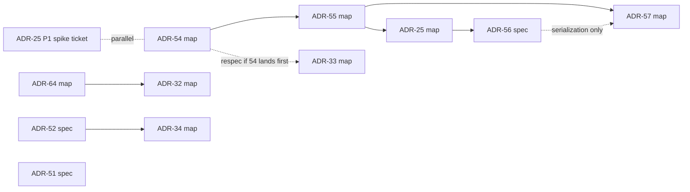

# Research #1389 — Unimplemented-ADR migration map

Findings for wayfinder ticket #1389 (map #1383). Inventory of the unimplemented
implementation-plan ADRs, verified against the tree at `origin/devel`
(2026-07-16), with a per-ADR migration matrix, the re-grill lists, pilot
recommendations, and the proposed next map/spec tickets. No issues were created;
this document proposes them.

Verification method: every Status line read from the ADR file itself; landed
code cross-checked by symbol grep against today's tree (the local clone is
shallow — 206 commits — so `git log --grep` is not usable as evidence; PR states
via `gh` are the authoritative history probe). No open PR claims any of these
ADRs. Three read-out agents verified the load-bearing code anchors per ADR;
file:line citations below are from those probes.

## 1. Status verification (ticket claims vs source)

| ADR | Status line (verified in ADR.md) | Implemented? | Drift vs ticket |
| --- | --- | --- | --- |
| 25 | Proposed (REVISED 2026-07-04, DNSBL enforcement engine of the trilogy) | No — new entities absent from tree | none |
| 27 | Accepted Part 1 · Implementing Part 2 (only the real version-flip deferred) | Parts 1+2 machinery merged (PRs #307, #312) | none |
| 32 | Proposed (refreshed 2026-07-03; §2.0 seam fork open, blocks Phases 2–4) | No | none |
| 33 | Proposed (refreshed 2026-07-03) | No | none |
| 34 | Proposed (refreshed 2026-07-03; §2.0 open fork re-scopes Phase 1) | No | anchors now MORE stale (see §3) |
| 51 | Proposed (2026-06-29; forks "block phase-prompt authoring") | No | **zero phase prompts exist** — "fully proposed" overstates it |
| 52 | Proposed (2026-06-29). Not yet implemented | No | none |
| 54 | Proposed (2026-07-04) | No | none |
| 55 | Proposed (2026-07-04) | No | none |
| 56 | Proposed — deferred (do not start before ADR-25 Accepted) | No — sketch only, 0 phase prompts | none |
| 57 | Proposed — deferred (last in sequence) | No — sketch only, 0 phase prompts | none |
| 64 | Proposed (2026-07-13) | No | **one premise stale** (see §3) |

Unimplemented-ness was verified structurally, not just by Status: the new config
sections (`pfblockerngfeeds`, `pfblockerngfeedgroups`, `pfblockerngclientgroups`),
tokens (`policy_only`, `pfB_CG_`, `gpClientGroups`, `geoip_provider`), and pages
(`pfblockerng_group_policy*`, `pfblockerng_diagnostics.*`, `pfblockerng_feed_edit.php`)
all have zero hits in `src/`.

## 2. Dependency structure (verified against ADR texts)

The ticket's cluster chain is confirmed but with two softenings worth encoding
in the map:

- **ADR-54 → ADR-55 → ADR-25 → ADR-56** holds verbatim (ADR-55: "Depends on:
  ADR-54 complete"; ADR-25: "Phases 2–7 run after ADR-55 completes"; ADR-56:
  "do not start before ADR-25's decision layer is Accepted").
- **ADR-25 Phase 1 (cache-bleed spike) is explicitly parallel**: "start
  IMMEDIATELY, parallel to ADR-54/55". The spike is a research ticket that can
  run alongside the ADR-54 map.
- **ADR-57 does not need ADR-25**: "Depends on: ADR-54 + ADR-55 complete …
  independent of ADR-25's DNSBL layer but sequenced after ADR-56 to keep one
  migration in flight at a time". The 56→57 edge is a serialization preference,
  not a real dependency — worth preserving as policy, but the map should record
  it as soft.
- **ADR-64 blocks ADR-32** — hard and bidirectional: ADR-32 says "ADR-64 must
  land before Phase 2" and ADR-64's DoD closes the loop ("ADR-32's prerequisite
  is satisfied"). Neither GeoIP ADR references ADR-57; the "GeoIP fold-in" the
  provider work depends on is ADR-64 (which folds in closed #1235), not ADR-57.
- **ADR-54 re-bases ADR-33**: ADR-54 §2.8 — "ADR-33 … is re-based by this ADR …
  a small respec, ADR-33 is not landed". ADR-33 can proceed first; if ADR-54
  lands first, ADR-33's spec needs the respec pass. Soft, ordering-sensitive
  edge — record it on both maps.
- **ADR-34 ↔ ADR-52 are NOT independent** (ticket drift — the ticket proposed
  independent maps for 33/34/51/52). ADR-52 §1.3/§2.1 annexes ADR-34's surface:
  both create `pfblockerng_diagnostics.inc`, ADR-52 "establishes the
  Diagnostics page" and ADR-34 later adds "additional cards on the same page";
  the tab location conflicts (ADR-34 says under Reports, ADR-52 makes it a
  top-level Diagnostics tab, and instructs "ADR-34/#364 should reconcile to
  that"). Order: **ADR-52 first, ADR-34 extends it.**
- **ADR-33 and ADR-51 are genuinely independent** — confirmed; neither
  references the other, the diagnostics pair, the trilogy, or the GeoIP pair.
  ADR-51's prerequisites (ADR-42 sidecars, ADR-43 trigger API, PR #624 force
  modes) are all landed and verified live.

## 3. Stale current-code assumptions (verified this session)

Each of these invalidates specific ADR text and must be corrected in the
migrated spec, not inherited:

1. **`format_hint` manifest key is retired** (ADR-54 §1.4/§2.3, ADR-25 §1.4
   still list it). The manifest emission at `pfblockerng.inc:8410-8414` emits
   only `raw/feed/group/provenance/log_flag[/mode]`; `pfb_unbound.py:4147`
   records "format_hint's whole-feed dispatch retired" (ADR-62/#1083). Any
   "byte-identical manifest" oracle must be re-pinned from the live emission.
2. **ADR-64's #1246 premise is stale**: "#1246: nothing tests it" is no longer
   true — `tests/php/GeoipContinentUndefinedBucketTest.php` (PR #1338) and the
   continent-only Blocks fixtures + `tests/smoke/test_smoke_ip_recompute.py`
   (PR #1364) landed. ADR-64 Req 5 / Phase 6 largely plan tests that now exist;
   re-scope at grilling.
3. **New unnamed anchor for both GeoIP ADRs**: PR #1413 (`db0af3df`) inserted a
   cat-failure/partial-output guard into the exact Locations parse loop both
   Phase-1 oracles capture (`pfblockerng.php` ~`:886-917`, pinned by
   `GeoipContinentCatStderrGuardTest.php`). Both ADRs predate it; the oracles
   must preserve it.
4. **ADR-34's matcher anchors are materially dead**: `pfb_dnsbl_parse()` no
   longer exists in `src/`, and the legacy `unbound_py_data`/`unbound_py_zone`
   CSVs were retired as writer targets by ADR-65 (`pfblockerng.inc:1862`
   "retired writer targets, never written again"). ADR-34's own §2.0 fork
   (PHP parity matcher vs `python_control explain` op) is now effectively
   forced toward fork-b — the PHP-side data it would have parsed is gone.
5. **ADR-52 cites the wrong file for one secret**: `maxmind_account` is not in
   `pfblockerng_install.inc`; it lives at `pfblockerng.inc:2699` (notice
   function `:2628`). The secret inventory is otherwise live
   (`asn_token` `pfblockerng.inc:2696`, `varsyncpassword` `:20389`).
6. **ADR-25/55 legacy-bypass interchange is NOT stale** — worth stating because
   ADR-65 retired the other interchange files: the `[GP_Bypass_List]` ini
   (write `pfblockerng.inc:8880`, read `pfb_unbound.py:1643`, lookup `:3208`)
   survives ADR-65 untouched. The trilogy's migration premise holds.
7. **Line-number drift is universal** (hundreds of lines in `pfblockerng.inc`);
   every symbol checked still exists except as noted above. Migrated specs
   should cite symbols, not line numbers.

## 4. Migration matrix

Legend — Migrate-as-map: becomes its own dependency-linked ticket map with a
grilled spec per bounded chunk. Migrate-as-spec: one grilled spec ticket
covers it. Retire: no spec; disposition noted. "Phase mechanics" (the embedded
§6 phase plans and phase-prompt `.txt` files) are obsolete under the new
workflow in ALL cases and are not migrated — requirements and rationale are.

| ADR | Disposition | Requirements (migrate) | Rationale (keep as history) | Obsolete (drop) | Re-grill before spec |
| --- | --- | --- | --- | --- | --- |
| 54 Feed/FG normalization | **Map** (cluster head) | First-class FEED + M:N FEED GROUP entities; per-family header uniqueness; idempotent migration + downgrade mirror; byte-identical materialization oracles | Row duplication is a storage accident; normalize behind oracles before enforcement rides on it | 4 phase prompts + §6 plan | Manifest golden re-pinned from live emission (`format_hint` gone); frozen downgrade-mirror posture (keep vs drop); shipping `policy_only` vocabulary ahead of the ADR-25 engine; the ADR-33 respec interaction |
| 55 Client Groups/policy | **Map** | CLIENT GROUP entity + `pfB_CG_{name}` alias; CG↔FG policy bindings with overrides + `sched`; scoped IP rules never removing defaults; dead-override validation; zero-CG byte-identical oracle; `Legacy_Bypass` migration | Rule-scoping seam already exists (single-valued) — per-edge is an extension, not a new mechanism; never ship a silently no-op control | 4 phase prompts + §6 plan | Dead-override matrix re-pinned against live ADR-41 `pass_order` buckets; rule-multiplication cap (none vs `maximumtableentries`-derived); stored-but-locked DNSBL bindings seam to ADR-25; `action_override` enum handling |
| 25 DNSBL engine (revised) | **Map** + separate spike ticket | Default+exceptions per-client DNSBL over 54/55 entities; bitmask membership + per-IP CG cache; cache-bleed closed on both axes; TZ-explicit chroot schedules; deterministic resolution ladder; zero-CG byte-identical; closes #384/#321/#315/#377/#386 | Client IP already in hand (`get_q_ip`) — no new Unbound plumbing; cache-bleed made a measured Phase-1 decision with an explicit REJECT fork | 7 phase prompts + §6 plan | Cache-scheme fork (divergence-gated `no_cache_store` vs module TTL cache vs views) — spike-gated with a kill threshold; chroot TZ serialisation; manifest key list (stale `format_hint`); legacy `pfb_gp` retirement timing |
| 56 Per-CG DNSBL axes | **Spec** (deferred) | CG-level `ss_enforce`/`doh_enforce` toggles riding ADR-25 machinery; absent ⇒ today's behaviour | ADR-25 §2.4 explicitly deferred these axes here | none (sketch, 0 prompts) | Everything — sketch-level by design; grill in full when ADR-25 is Accepted |
| 57 GeoIP fold-in | **Map** (deferred) | Continents as Feed Groups of per-country feed entities (`managed_by=geoip`); M:N cross-continent groups + CG bindings; one-time mirrored migration, zero-change oracles | GeoIP currently lives outside the normalized model on purpose (ADR-54 §2.4 left it untouched) | none (sketch, 0 prompts) | Everything at pickup; specifically country-set × M:N vs `maximumtableentries`, and ADR-40 reputation/dedup re-pinning. Record the 25-independence + soft 56→57 ordering |
| 64 GeoIP truth table | **Map** | In-tree ISO-keyed country/continent truth; reproducible generator (pinned+sha256, hard-fail, `--check` in CI); byte-identical preservation set (keys, `XK`, geoname bucket ids); 7 unknown buckets; monthly tracker + red canary; localized names from table | Measured factual spine (250-ISO parity, 6 stale names, 0 flagged rows, 2 pseudo-country rows); rejected vendor-as-truth alternative | 6 phase prompts + §6 plan | Re-scope Req 5/Phase 6 (the #1246 tests already landed); fold the PR #1413 cat-failure guard into the oracle; owner sign-off on D1 UI name changes (Eswatini, Türkiye, …); accept 2 new pinned upstream deps; CLDR vs `iso-codes` fork; tracker cadence |
| 32 IPinfo provider | **Map** (blocked on 64) | Provider seam serving FIVE consumers across three languages; `geoip_provider`/`asn_provider` settings, no per-consumer mixing; maxmind byte-identical oracle; IPinfo fetch rides `$pfb['extras']`; graceful degradation, config never mutated | Consumer inventory (PHP build, PHP log-enrich, Python chroot, sh `mmdblookup`, sh ASN) kills a PHP-interface seam; IPinfo ASN already ships via extras (precedent) | 7 phase prompts + §6 plan | Fork 1 (MMDB-as-seam vs PHP interface — blocks everything downstream, likely collapses 3 phases); fork 2 (extras pipeline — confirm); fork 3 (CIDR parser language, moot if fork 1 = MMDB); RAM/time reject criterion on smallest box |
| 33 Auto feed mgmt | **Map** (independent) | Opt-in reconciler vs `pfblockerng_feeds.json` (`off`/`notify`/`auto`, default inert); pure index+plan functions keyed (category, header); never-delete apply with backup; status-before-url precedence; manual + hook triggers | Never-destructive posture; catalog `status`/`past_urls` fields exist for exactly this | 6 phase prompts + §6 plan | Intra-category duplicate handling (open owner sub-choice); `Suspended` status handling; `auto`-mutates-config reject fork (reduce to notify-only?); the ADR-54 respec edge |
| 34 Triangulator | **Map** (after ADR-52; fork first) | Read-only diagnosis engine + `pfb_triangulate` report; correct layer attribution + match classification; plain-English explanations; Alerts-row + free-form entry; bounded/validated input | Fork-b ("ask the component that already knows" via `python_control explain`) avoids a second drifting matcher — now effectively forced (see §3.4) | 6 phase prompts + §6 plan | §2.0 matcher fork — re-grill as "confirm fork-b" given the PHP-side anchors are gone; page/tab ownership reconciled to ADR-52's top-level Diagnostics; per-entry-path scoping of query-time verdicts |
| 51 Unified force detection | **Spec** (independent) | 304-with-missing-hash ⇒ reparse-from-cache; ingest self-heal (second tick no-op, test-pinned); force modes = sidecar removal only; remove `reuse`/`force` flag + adapters; cron path byte-identical | One change-detection story: detector is the single authority; prerequisites (ADR-42/43, PR #624) verified landed and live | §6 prose plan (no prompts ever authored) | Fork 1: full Force×feed-class table vs scope-down to remote-conditional-GET (ADR recommends scope-down — retitle); fork 2: `pfb_reuse` field fate; fork 3: per-feed reuse-signal mechanism |
| 52 Sanitized export | **Spec** (lands Diagnostics page first) | Diagnostics page + sanitized `.xml` export card; DOM-walk redaction (CDATA-safe, never regex-over-serialized); drop `pfblockerngsync`+`hooks`; adversarial "no known secret survives" acceptance; harness word-set parity | Under-redaction is the cardinal risk; pure-PHP core is fully off-appliance adversarially testable | 4 phase prompts + §6 plan | Feed-URL strip granularity (whole query vs per-param); adopt the fail-closed `pfb_cfg_registry()`-walk inventory test?; confirm top-level Diagnostics tab as the page ADR-34 will extend; fix the `maxmind_account` file citation |
| 27 Part 2 residue | **Retire** (no spec, no map) | The only deferred action is a one-line matrix edit (`build` → `route-only` in ci-metadata `supported-versions.json`) "the day the min supported pfSense first advances" — operational trigger, not engineering | Machinery + tests all merged (PRs #307/#312 + follow-ups); design closed | n/a | None. One tiny docs ticket: add the flip step to `docs/misc/version-bump-runbook.md`, which currently has zero `route-only` mentions — the runbook that should trigger the flip does not know about it |

**Counts: 8 migrate-as-map** (54, 55, 25, 64, 32, 33, 34, 57 — the last two
gated/deferred), **3 migrate-as-spec** (51, 52, 56 — the last deferred),
**1 retire** (ADR-27 Part 2 residue → docs ticket only).

## 5. Pilot recommendation

Criteria from the ticket: exercise legacy surfaces, external integrations, UI,
and high-risk behavior — without starting with the largest cluster.

1. **Pilot A (single-spec pilot): ADR-52.** Most implementation-ready of the
   whole inventory: 0 open design forks, pure-PHP security core, adversarial
   acceptance already articulated. Exercises: high-risk behavior (secret
   redaction — fail-closed by design), UI (a new page + the cross-page tab
   sweep + priv table), and legacy surfaces (14k-line `.inc`, priv/tab
   machinery). Small enough to prove the grilled-spec → ticket → fresh-session
   flow end to end.
2. **Pilot B (map pilot): ADR-64.** A genuine multi-ticket map with a real
   downstream dependent (ADR-32), external integrations (pinned GeoNames +
   CLDR/`iso-codes` sources, a monthly tracker workflow with a red canary),
   legacy GeoIP parse code, and a behaviour-changing rewire behind an oracle.
   Also the freshest ADR (2026-07-13) yet already carrying verified premise
   drift (§3.2–3.3) — a good test of whether the grilling step catches stale
   inputs.
3. **Second wave, not a pilot: ADR-51** as the "grill-first" exemplar — three
   open forks and zero phase prompts mean it tests the re-grill flow itself
   (decide the scope-down fork with the owner, then one spec). Do not pilot
   with it because its verdict depends on an owner decision, not on the
   workflow.

The trilogy (54/55/25) is explicitly NOT a pilot — largest cluster, and its
owner decisions from 2026-07-04 are still fresh; migrate it once the pilots
prove the mechanics.

## 6. Proposed next tickets (titles + one-line question — fog stays fog)

Bounded map/spec/grill tickets only; no implementation tickets are proposed.

1. `SPEC: ADR-52 sanitized configuration export` — grill: whole-query vs
   per-param URL stripping, and is the fail-closed registry-walk inventory test
   adopted? (Pilot A)
2. `MAP: ADR-64 in-tree GeoIP country/continent truth table` — grill: what
   remains of Req 5/Phase 6 now that the #1246 tests landed, CLDR vs
   `iso-codes`, and does the owner accept the D1 visible name changes? (Pilot B)
3. `GRILL: ADR-51 force-detection scope` — decide fork 1 (scope-down to
   remote-conditional-GET vs full Force×feed-class table) plus the `pfb_reuse`
   and reuse-signal forks; output is one spec ticket.
4. `MAP: ADR-33 auto feed management` — grill: intra-category duplicate
   handling, `Suspended` semantics, and whether `auto` survives its
   mutates-user-config reject fork.
5. `GRILL: ADR-32 provider seam fork` — after ADR-64 lands: MMDB-as-seam vs
   PHP interface (fork 1); the map cannot be charted until this is decided.
6. `MAP: ADR-54 feed/feed-group normalization (cluster head)` — grill: downgrade
   mirror posture, live-manifest golden, and shipping `policy_only` ahead of the
   engine; opens the trilogy after the pilots pass.
7. `RESEARCH: ADR-25 Phase-1 cache-bleed spike` — parallel to the ADR-54 map by
   the ADR's own design; measured verdict with an explicit kill threshold.
8. `DOCS: add the route-only version-flip step to the version-bump runbook` —
   closes out the ADR-27 Part 2 residue; the flip itself executes during the
   next min-version bump.

Fog: ADR-55 and ADR-25 maps (chart after the ADR-54 map is grilled), ADR-34 map
(after ADR-52 lands and the matcher fork is confirmed), ADR-56 spec and ADR-57
map (after ADR-25 / by explicit pickup), ADR-32 map (after ticket 5's fork
verdict).
