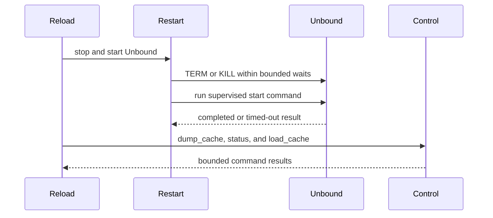

<!-- This is an auto-generated comment: summarize by coderabbit.ai -->
<!-- review_stack_entry_start -->

<!-- review_stack_entry_end -->
<!-- This is an auto-generated comment: rate limited by coderabbit.ai -->

> [!WARNING]
> ## Review limit reached
> 
> **Next included review available in 32 minutes.**
> 
> [Check out review usage here](https://app.coderabbit.ai/dashboard/review-capacity?orgId=db95624d-8807-49f4-a2e1-56a318eb7241).
> 
> 

> 
View limit details

> 
> **Limit details:** You’ve used the included review currently available.
> 
> You've used all free OSS reviews for now. Wait for the free limit to reset to keep reviewing this public repository.
> 
> [Learn how review limits work](https://docs.coderabbit.ai/management/plans#rate-limits).
> 
> **Review configuration:**
> 
> 

> 
⚙️ Run configuration

> 
> **Configuration used**: Organization UI
> 
> **Review profile**: CHILL
> 
> **Plan**: Advanced
> 
> **Run ID**: `03811b45-2800-42d5-9cef-48bc9d119ec7`
> 
> 

> 
> 

> 
📥 Commits

> 
> Reviewing files that changed from the base of the PR and between 0f84b1cb9622e93dfba0daa99698d6cd0c821701 and 71df67073b8704c6389e3c544bf1a5b68aa6aa4d.
> 
> 

> 
> 

> 
📒 Files selected for processing (2)

> 
> * `src/usr/local/pkg/pfblockerng/pfblockerng.inc`
> * `tests/php/assert_unbound_recovery_3_3.php`
> 
> 

> 
> 

<!-- end of auto-generated comment: rate limited by coderabbit.ai -->

<!-- recent_review_start -->

No actionable comments were generated in the recent review. 🎉

ℹ️ Recent review info

⚙️ Run configuration

**Configuration used**: Organization UI

**Review profile**: CHILL

**Plan**: Advanced

**Run ID**: `01002e0b-352f-4769-8032-3d5ae59fcd91`

📥 Commits

Reviewing files that changed from the base of the PR and between 498690ef7c7f54d4475d9773064f28fadc45ffb9 and 0f84b1cb9622e93dfba0daa99698d6cd0c821701.

📒 Files selected for processing (4)

* `src/usr/local/pkg/pfblockerng/pfblockerng.inc`
* `src/usr/local/pkg/pfblockerng/pfblockerng_install.inc`
* `tests/php/assert_unbound_recovery_3_3.php`
* `tests/test_unbound_recovery_3_3.py`

**Included review availability:** Your plan provides up to 1 included review per hour; 0 remain after this review.

---

<!-- recent_review_end -->
<!-- walkthrough_start -->

📝 Walkthrough

## Walkthrough

### Changes

**Unbound recovery flow**

|Layer / File(s)|Summary|
|---|---|
|**Stop and supervise Unbound startup**   `src/usr/local/pkg/pfblockerng/pfblockerng.inc`|The restart function adds bounded waits, PID and name-based termination, KILL escalation, startup supervision, completion tracking, and distinct timeout or setup failures.|
|**Classify restart and control outcomes**   `src/usr/local/pkg/pfblockerng/pfblockerng.inc`, `src/usr/local/pkg/pfblockerng/pfblockerng_install.inc`|Control commands use bounded execution. Failed cache dumps are cleared. Reload preserves configuration for incomplete recovery. Install migration now reports restart failure.|
|**Exercise recovery boundaries**   `tests/php/assert_unbound_recovery_3_3.php`, `tests/test_unbound_recovery_3_3.py`|The tests cover process cleanup, restart outcomes, cache handling, status checks, install reporting, PHP linting, and assertion-runner success.|

<!-- change_assessment_start -->
**Priority:** ➖ Normal

**Estimated code review effort:** 4 (Complex) | ~60 minutes

<!-- change_assessment_commit:"0f84b1cb9622e93dfba0daa99698d6cd0c821701" -->
**Change:** Bug fix · **Severity of issue fixed:** Medium
<!-- change_assessment_end -->

### Sequence Diagram(s)

<!-- walkthrough_end -->
<!-- final_review_risk_start -->
**Merge Risk:** _⚪ Minimal_ · up to `0f84b`
<!-- final_review_risk_coverage:{"sourceCommitId":"0f84b1cb9622e93dfba0daa99698d6cd0c821701","coveredCommitId":"0f84b1cb9622e93dfba0daa99698d6cd0c821701","kind":"reviewed"} -->

The bounded recovery changes are mergeable based on the supplied evidence; live-appliance validation remains ordinary deployment verification rather than a demonstrated defect.
<!-- final_review_risk_end -->
<!-- pre_merge_checks_walkthrough_start -->

🚥 Pre-merge checks | ✅ 4 | ❌ 1

### ❌ Failed checks (1 warning)

|     Check name     | Status     | Explanation                                                                                                                                                                                               | Resolution                                                                         |
| :----------------: | :--------- | :-------------------------------------------------------------------------------------------------------------------------------------------------------------------------------------------------------- | :--------------------------------------------------------------------------------- |
| Docstring Coverage | ⚠️ Warning | Docstring coverage is 38.89% which is insufficient. The required threshold is 80.00%. Docstring coverage is scoped to functions touched by this diff. Analyzed 18 functions across 2 files. (2 skipped: … | Write docstrings for the functions missing them to satisfy the coverage threshold. |

✅ Passed checks (4 passed)

|         Check name         | Status   | Explanation                                                                                                                                                                                               |
| :------------------------: | :------- | :-------------------------------------------------------------------------------------------------------------------------------------------------------------------------------------------------------- |
|     Linked Issues check    | ✅ Passed | The PR implements the coding requirements in `#3292`. It adds bounded TERM/KILL stop handling, refuses a second start when the old daemon survives, handles PID fallback, supervises startup without reapi… |
| Out of Scope Changes check | ✅ Passed | The changes stay within `#3292`. They modify the release/3.3 Unbound recovery and conditional install-migration restart paths, add focused regression tests, and add no DNSBL pipeline architecture, resol… |
|      Description Check     | ✅ Passed | Check skipped - CodeRabbit’s high-level summary is enabled.                                                                                                                                               |
|         Title check        | ✅ Passed | The title clearly and concisely describes the main change: backporting bounded Unbound recovery to release 3.3.                                                                                           |

Full details: Docstring Coverage

**Explanation**

Docstring coverage is 38.89% which is insufficient. The required threshold is 80.00%. Docstring coverage is scoped to functions touched by this diff. Analyzed 18 functions across 2 files. (2 skipped: 2 unsupported.)

<!-- pre_merge_checks_walkthrough_end -->
<!-- finishing_touch_checkbox_start -->

✨ Finishing Touches 💡 1

<!-- finishing_touch_suggestion:docstrings -->

📝 Generate docstrings 💡

- [ ] <!-- {"checkboxId":"7962f53c-55bc-4827-bfbf-6a18da830691"} --> Create stacked PR
- [ ] <!-- {"checkboxId":"3e1879ae-f29b-4d0d-8e06-d12b7ba33d98"} --> Commit on current branch

<!-- finishing_touch_checkbox_end -->
<!-- tips_start -->

---

Thanks for using [CodeRabbit](https://coderabbit.ai?utm_source=oss&utm_medium=github&utm_campaign=pfBlockerNG/pfBlockerNG&utm_content=3293)! It's free for OSS, and your support helps us grow. If you like it, consider giving us a shout-out.

❤️ Share

- [X](https://twitter.com/intent/tweet?text=I%20just%20used%20%40coderabbitai%20for%20my%20code%20review%2C%20and%20it%27s%20fantastic%21%20It%27s%20free%20for%20OSS%20and%20offers%20a%20free%20trial%20for%20the%20proprietary%20code.%20Check%20it%20out%3A&url=https%3A//coderabbit.ai)
- [Mastodon](https://mastodon.social/share?text=I%20just%20used%20%40coderabbitai%20for%20my%20code%20review%2C%20and%20it%27s%20fantastic%21%20It%27s%20free%20for%20OSS%20and%20offers%20a%20free%20trial%20for%20the%20proprietary%20code.%20Check%20it%20out%3A%20https%3A%2F%2Fcoderabbit.ai)
- [Reddit](https://www.reddit.com/submit?title=Great%20tool%20for%20code%20review%20-%20CodeRabbit&text=I%20just%20used%20CodeRabbit%20for%20my%20code%20review%2C%20and%20it%27s%20fantastic%21%20It%27s%20free%20for%20OSS%20and%20offers%20a%20free%20trial%20for%20proprietary%20code.%20Check%20it%20out%3A%20https%3A//coderabbit.ai)
- [LinkedIn](https://www.linkedin.com/sharing/share-offsite/?url=https%3A%2F%2Fcoderabbit.ai&mini=true&title=Great%20tool%20for%20code%20review%20-%20CodeRabbit&summary=I%20just%20used%20CodeRabbit%20for%20my%20code%20review%2C%20and%20it%27s%20fantastic%21%20It%27s%20free%20for%20OSS%20and%20offers%20a%20free%20trial%20for%20proprietary%20code)

<!-- poem_footer_start -->
A rabbit watched the resolver wake, With bounded clocks for safety’s sake. TERM then KILL, but not too long, Fresh status marks the startup song. Cache loads only when results are true. Tests hop past, and logs report too.
<!-- poem_footer_end -->

Comment `@coderabbitai help` to get the list of available commands.

<!-- tips_end -->